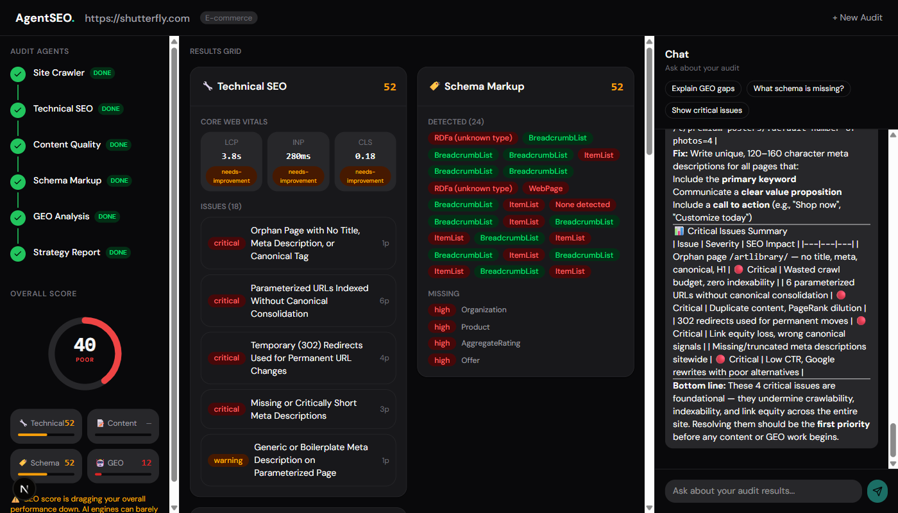
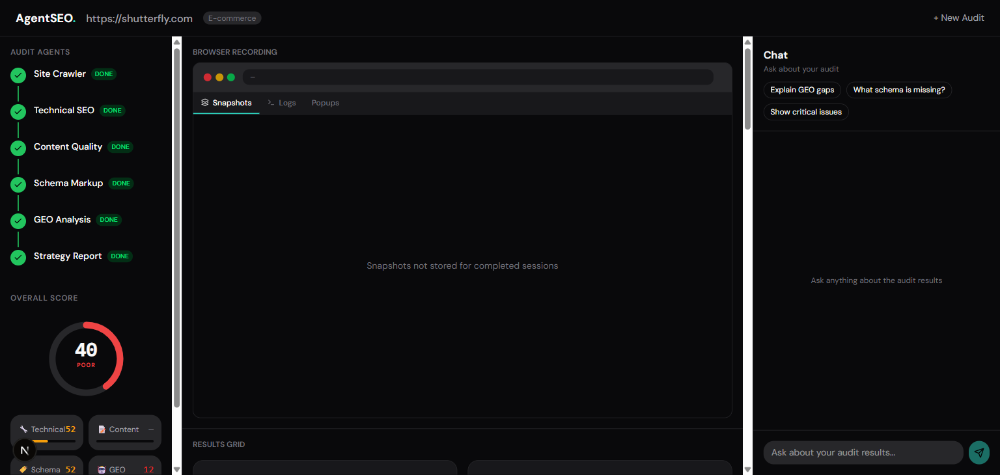
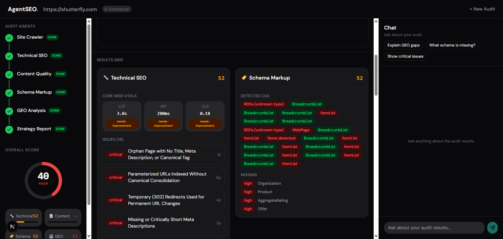
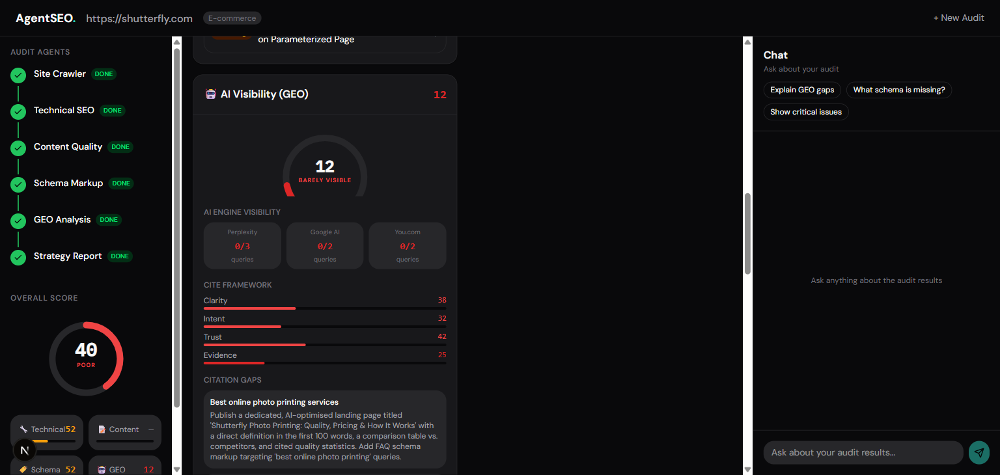
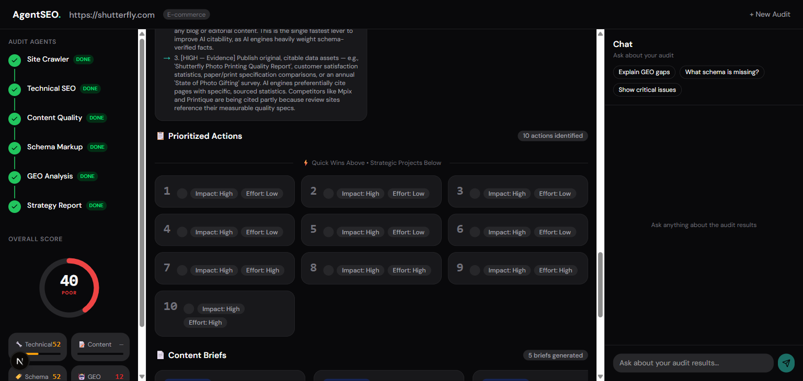
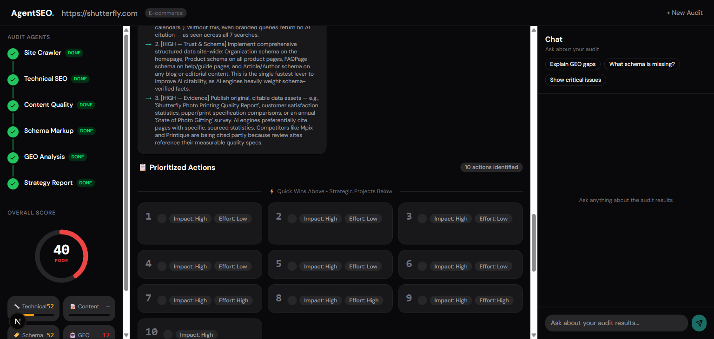
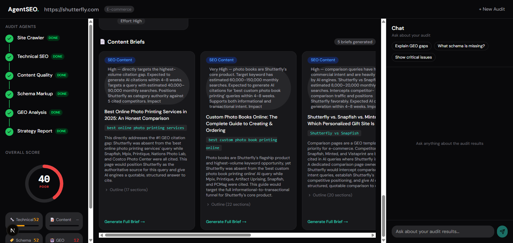

# AgentSEO

**Multi-agent SEO & GEO intelligence platform.** Runs a live cloud browser, dispatches parallel AI agents, and streams real-time audit results to the dashboard — all from a single URL input.



---

## What It Does

Enter any domain. AgentSEO spins up a real cloud browser (Browser-Use Cloud), then launches six specialized AI agents in parallel that browse, extract, and analyze your site across four dimensions:

| Agent | What it analyzes |
|-------|-----------------|
| 🕷️ **Crawler** | Discovers pages via sitemap / robots.txt, captures HTML + screenshots |
| 🔧 **Technical** | Core Web Vitals, meta tags, redirects, canonical issues, indexability |
| 📝 **Content** | E-E-A-T signals, thin pages, readability, author/contact/date signals (with Vision AI) |
| 🏷️ **Schema** | JSON-LD detection, type coverage, validation errors |
| 🤖 **GEO** | AI Visibility — searches Perplexity, Google, and Gemini to see if your site is cited |
| 📊 **Strategist** | Synthesizes all results into a prioritized action plan + content briefs |

After the audit, an **AI chat assistant** with RAG (Retrieval-Augmented Generation) lets you ask natural-language questions about the results — backed by semantic search over the full audit data.

---

## Screenshots

<table>
<tr>
  <td></td>
  <td></td>
</tr>
<tr>
  <td></td>
  <td></td>
</tr>
<tr>
  <td></td>
  <td></td>
</tr>
</table>

---

## Feature Highlights

- **Live browser streaming** — watch the agent browse your site in real time via embedded iframe
- **Screenshot filmstrip** — JPEG frames captured every ~700ms during crawl
- **Parallel agent pipeline** — 5 agents run concurrently after the crawl completes
- **Vision-powered E-E-A-T** — Claude vision API analyzes page screenshots for trustworthiness signals
- **GEO / AI Visibility** — 7 searches across Perplexity, Google, and Gemini to measure AI citation
- **Schema validation** — detects all JSON-LD types, groups duplicates, flags issues
- **RAG chat** — post-audit AI chat using OpenAI embeddings + cosine similarity (no vector DB needed)
- **Audit history** — all results stored in SQLite, accessible from the homepage
- **Resilient navigation** — handles ERR_ABORTED, redirects, popup/cookie banner dismissal

---

## Tech Stack

| Layer | Technology |
|-------|-----------|
| Framework | Next.js 16 (App Router) + React 19 |
| AI / Agents | Vercel AI SDK v4, Anthropic Claude, OpenAI (embeddings) |
| Browser | Browser-Use Cloud (`browser-use-sdk`) + Playwright over CDP |
| State | Zustand v5 |
| Database | SQLite via better-sqlite3 + Drizzle ORM |
| Styling | Tailwind CSS v4, Framer Motion, Lucide icons |
| Streaming | Vercel AI SDK `createDataStreamResponse` (SSE) |

---

## Project Structure

```
seo-geo/
└── agent-seo/           # Next.js application
    ├── src/
    │   ├── agents/      # AI agent implementations + markdown prompts
    │   │   ├── supervisor.ts     # Orchestrator — runs the full pipeline
    │   │   ├── crawler.ts        # Sitemap discovery + HTML capture
    │   │   ├── technical.ts      # CWV + on-page SEO checks
    │   │   ├── content.ts        # E-E-A-T + content quality (vision)
    │   │   ├── schema.ts         # JSON-LD validation
    │   │   ├── geo.ts            # AI visibility (Perplexity/Google/Gemini)
    │   │   ├── strategist.ts     # Action plan synthesis
    │   │   └── prompts/          # Agent system prompts (*.md)
    │   ├── components/
    │   │   ├── audit/            # Dashboard, result cards, live browser
    │   │   ├── chat/             # RAG chat panel
    │   │   └── ui/               # Primitive UI components
    │   ├── lib/
    │   │   ├── browserbase.ts    # Browser-Use Cloud session init
    │   │   ├── db.ts             # Drizzle client + SQLite helpers
    │   │   ├── embeddings.ts     # RAG: chunk building, embed, search
    │   │   ├── html-parser.ts    # Server-side HTML extraction
    │   │   ├── types.ts          # Shared TypeScript types + SSE event union
    │   │   └── schema.ts         # Drizzle DB schema
    │   ├── stores/
    │   │   └── audit-store.ts    # Zustand store — handles all SSE events
    │   └── tools/
    │       ├── playwright.ts     # Playwright tools (navigate, screenshot, popups)
    │       └── extractors.ts     # JS scripts for CWV + page data
    └── app/
        ├── page.tsx              # Homepage with audit input + history
        ├── audit/[id]/           # Live audit + historical results page
        └── api/
            ├── audit/            # POST — starts audit, returns SSE stream
            ├── chat/             # POST — RAG chat endpoint
            ├── embed/            # POST — build + store embeddings
            ├── embed/status/     # GET  — check if embeddings are ready
            └── history/          # GET  — list past audits
```

---

## Getting Started

### Prerequisites

- Node.js 18+
- API keys for Anthropic, Browser-Use Cloud, and OpenAI

### Installation

```bash
git clone https://github.com/code-crack0/seo-geo.git
cd seo-geo/agent-seo
npm install
```

### Environment Variables

Create `agent-seo/.env.local`:

```env
# Required
ANTHROPIC_API_KEY=sk-ant-...
BROWSERUSE_API_KEY=...
OPENAI_API_KEY=sk-...

# Server-side base URL (used by supervisor to trigger /api/embed after audit)
APP_URL=http://localhost:3000
```

### Run

```bash
cd agent-seo
npm run dev
```

Open [http://localhost:3000](http://localhost:3000), enter any domain, and watch the agents go.

---

## Architecture Deep Dive

### Agent Pipeline

```
POST /api/audit
  └── supervisor.ts
        ├── 1. Crawler (sequential)
        │     └── Discovers pages via sitemap → captures HTML + screenshots to SQLite
        └── 2. Parallel analysis (own browser tab each)
              ├── Technical  — CWV, meta, canonicals
              ├── Content    — E-E-A-T (+ Claude vision on screenshots)
              ├── Schema     — JSON-LD detection & validation
              └── GEO        — 7 AI engine searches (Perplexity × 3, Google × 2, Gemini × 2)
        └── 3. Strategist (no browser) — synthesizes → action plan + content briefs
        └── 4. DB save → fire POST /api/embed → emit audit_complete SSE
```

### Streaming Protocol

All events flow over a single SSE connection using Vercel AI SDK's data stream protocol (`2:[{type, ...}]`). The Zustand store dispatches each event type to the appropriate UI slice — no polling, no refetch.

### RAG Chat System

After an audit, all agent results are chunked into ~30–50 semantic segments and embedded with `text-embedding-3-small`. At chat time:

1. User message is embedded
2. Cosine similarity against all chunks returns top-8 (~2K tokens)
3. `streamText` gets compact overview + top chunks + a `getPageDetails(url)` tool
4. Total budget: ~4,600 tokens per message (vs ~40K for a full dump)

Historical audits auto-embed on first chat panel mount.

---

## Development

```bash
npm run dev          # Next.js dev server (port 3000)
npm run build        # Production build
npm run test         # Vitest unit tests
npm run test:e2e     # Playwright E2E tests
```

---

## License

MIT
